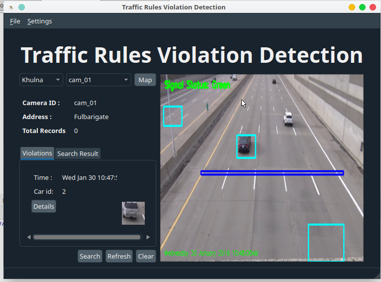

# traffic-rule-system-

<!-- PROJECT LOGO -->
 

  

  <h1 align="center">Traffic Rules Violation Detection and Monitoring System in Campus</h1>
  

   With the increasing number of vehicles, managing traffic and enforcing traffic laws has become a challenge. This project proposes a solution based on Computer Vision to automatically detect traffic rule violators within a campus environment. The system aims to detect violations such as overspeeding, triple riding, and failure to wear helmets.
Platform/Language Used: Python3, OpenCV, dlib
Technology Domain: Image and Video Processing, Computer Vision.
     
    

  

    <a href="https://github.com/pallavi-bhcf/Traffic Rules Violation Detection and Monitoring System in Campus.git"><strong>View Demo » </strong></a>
    ||
    <a href=""https://github.com/pallavi-bhcf/Traffic Rules Violation Detection and Monitoring System in Campus.git""><strong>Explore the docs » </strong></a>
  

 

<!-- TABLE OF CONTENTS -->

  
Table of Contents

  <ol>
    <li>
      <a href="#about-the-project">About The Project</a>
      <ul>
        <li><a href="#built-with">Built With</a></li>
      </ul>
    </li>
    <li>
      <a href="#getting-started">Getting Started</a>
      <ul>
        <li><a href="#prerequisites">Prerequisites</a></li>
        <li><a href="#installation">Installation</a></li>
      </ul>
    </li>
    <li><a href="#contributing">Contributing</a></li>
    <li><a href="#license">License</a></li>
    <li><a href="#contact">Contact</a></li>
    <li><a href="#acknowledgments">Acknowledgments</a></li>
  </ol>

<!-- ABOUT THE PROJECT -->

## About The Project
 
<STRONG>Traffic Rules Violation Detection and Monitoring System in Campus</STRONG>
  With the increasing number of vehicles, managing traffic and enforcing traffic laws has become a challenge. This project proposes a solution based on Computer Vision to automatically detect traffic rule violators within a campus environment. The system aims to detect violations such as overspeeding, triple riding, and failure to wear helmets.
Platform/Language Used: Python3, OpenCV, dlib
Technology Domain: Image and Video Processing, Computer Vision.

  
     
     
     
    

  </a>

  

<h3><strong>
The technology employs sensors, cameras, and advanced algorithms to track crowd size, density, and movement patterns. It aids in preventing overcrowding, managing crowd flow, and responding promptly to potential security threats or emergencies. The deployment of crowd detection systems reflects a growing recognition of the importance of leveraging technology to ensure the well-being of individuals in crowded spaces and to optimize the overall management of public events and areas.
</strong></h3>

(<a href="#readme-top">back to top</a>)

### Built With

This section should list any major frameworks/libraries used to bootstrap your project. Leave any add-ons/plugins for the acknowledgements section. Here are a few examples.

* [![OpenCV][OpenCV.shield]][OpenCV.url]
* [![Python][Python.shield]][Python.url]
* [![Keras][Keras.shield]][Keras.url]
* [![TensorFlow][TensorFlow.shield]][TensorFlow.url]
* [![Machine Learning Algorithms][ML.shield]][ML.url]
* [![Cloud Computing][Cloud.shield]][Cloud.url]
* [![Human-Computer Interaction (HCI)][HCI.shield]][HCI.url]

(<a href="#readme-top">back to top</a>)

<!-- GETTING STARTED -->
## Getting Started

CrowdSense is an innovative Crowd Detection Systems designed to enhance public safety and optimize urban planning by leveraging advanced technologies. Integrating Computer Vision and Deep Learning, CrowdSense gathers and processes real-time data from surveillance cameras and other sensors to monitor and analyze crowd dynamics. Unlike conventional systems that provide generic crowd information, CrowdSense tailors its insights based on specific environmental factors and user-defined parameters.

 

### What it does
 

<ul>
  <li><b>Behavioral Analysis and Anomaly Detection:</b>
CrowdSense goes beyond basic crowd counting by employing advanced behavioral analysis. It detects anomalies within the crowd, such as sudden movements, unusual patterns, or behaviors that deviate from the norm, aiding in early identification of potential security threats.
    </li>
   
  
  <li><b>Crowd Sentiment Analysis:</b>
  CrowdSense incorporates sentiment analysis into its features, gauging the overall mood of the crowd. This valuable insight aids in understanding the emotional context of gatherings, which can be crucial for event planning, public relations, and emergency response.
        </li>
   
  
  <li><b>Predictive Modeling for Crowd Trends:</b>
    Leveraging machine learning algorithms, CrowdSense goes beyond current crowd conditions to predict future trends. It considers historical data, weather forecasts, and previous event patterns to anticipate potential crowd surges or changes in behavior.
    </ul>
 

<!-- WHY IT'S USEFUL -->
### Why it's Useful
<ul> 
  <li><strong>Enhanced Public Safety:</strong> CrowdSense contributes to improved public safety by providing real-time insights into crowd behavior, enabling authorities to proactively address potential security threats or emergency situations.</li>
   
  <li><strong>Optimal Resource Allocation:</strong> The system aids in optimizing resource allocation by offering data-driven recommendations for crowd management, ensuring efficient deployment of personnel and resources during events or in public spaces.</li>
   
  <li><strong>Smart Urban Planning:</strong> CrowdSense assists in smart urban planning by providing valuable data on crowd movement, density, and behavior. This information can be utilized to optimize public spaces, transportation routes, and infrastructure development.</li>
   
   <li><strong>Timely Emergency Response:</strong> With its real-time monitoring capabilities, CrowdSense facilitates timely and informed emergency responses, helping mitigate risks and ensuring the safety of individuals in crowded environments.</li>
</ul>
 
    
<!-- PREREQUISITES -->
### Prerequisites

<b>Hardware</b> 

<ul>
 
  <li><strong>Server:</strong></li> 
  
A robust server infrastructure to host the crowd detection system. Consider using a high-performance server with sufficient processing power and memory to handle real-time data processing and analysis.

   

  <li><strong>Processor:</strong></li> 
  
Multi-core processor capable of handling the computational requirements for image processing, machine learning, and real-time crowd analysis.

   

  <li><strong>RAM:</strong></li> 
  
Adequate RAM to support the concurrent execution of computer vision algorithms, deep learning models, and database operations, ensuring optimal performance during peak usage.

   

  <li><strong>Storage:</strong></li> 
  
Significant storage capacity to accommodate the large volumes of data generated by surveillance cameras and sensors, as well as to store machine learning models, historical data, and system logs.

   
  </ul> 

<b>Software:</b> 
  
  <ul>
    <li><strong>Operating System</strong></li>
    
Linux or Windows Server, depending on the chosen software and infrastructure. Linux is often preferred for its stability and security in server environments.

     
    <li><strong>Client Devices:</strong></li>
    
No specific software requirements for client devices, as the crowd detection system is accessed through a web browser. Users may benefit from a modern browser supporting HTML5 for optimal user experience.     

     
   <li><strong>Libraries and Frameworks:</strong></li>
    
Utilize computer vision libraries (OpenCV) for image processing, deep learning frameworks (TensorFlow or keras) for crowd analysis, and web development frameworks (Flask or Django) for building the user       interface.

     
    <li><strong>Networking:</strong></li>
    
Implement secure networking protocols to facilitate communication between the server, surveillance cameras, and other connected devices. Consider encryption mechanisms to ensure data privacy and integrity.
    

  </ul>  
 

(<a href="#readme-top">back to top</a>)

<!-- INSTALLATION -->
### Installation

Follow these steps to install and set up the crowd detection system:
<ul>
 
  <li>Set Up Python Environment:</li> 
  
  - Install Python on your system if not already installed. You can download it from the official <b> Python website.</b>
   
  
  <li>Install Required Libraries:</li> 
  
  - Install OpenCV and TensorFlow using pip:

      pip install opencv  
      pip install tensorflow
     
  
  <li>Download Pre-trained Models:</li> 

  - Choose a pre-trained model for crowd detection. For example, you can use a MobileNet SSD model trained on the COCO dataset.
   

  <li>Write Crowd Detection Code: </li> 

  - Create a Python script or Jupyter notebook to perform crowd detection using OpenCV and TensorFlow. Load the pre-trained model, process video frames, and detect crowds.
 
   

  <li>Test Your Crowd Detection System:  </li> 

  - Use sample videos or webcam input to test your crowd detection system.

   
  
   <li>Documentation and Deployment:  </li> 
   
  - Document your code, including details on how to use it, dependencies, and potential configuration options.
  - If applicable, consider deploying your crowd detection system in a production environment.
   
   
  
  <li>Share and Collaborate:  </li> 
    
  - Share your project on platforms like GitHub to allow collaboration and feedback from the community. 

   
  
</ol>

(<a href="#readme-top">back to top</a>)

<!-- CONTRIBUTING -->
## Contributing
Contributions are welcome! Fork the repo, create a feature branch, commit changes, and open a pull request. Don't forget to give the project a star!

1. Fork the Project
2. Create your Feature Branch (`git checkout -b feature/AmazingFeature`)
3. Commit your Changes (`git commit -m 'Add some AmazingFeature'`)
4. Push to the Branch (`git push origin feature/AmazingFeature`)
5. Open a Pull Request

(<a href="#readme-top">back to top</a>)

<!-- LICENSE -->
## License

Distributed under the MIT License. See `LICENSE.txt` for more information.

(<a href="#readme-top">back to top</a>)

<!-- CONTACT -->
## Contact

Your Name - 2022d1r003@mietjammu.in

Project Link: [https://github.com/Manish10272/CROWD-DETECTION-SYSTEM.git](https://github.com/Manish10272/CROWD-DETECTION-SYSTEM.git)

(<a href="#readme-top">back to top</a>)

<!-- ACKNOWLEDGMENTS -->
## Acknowledgments

The accomplishment of this Major Project report on “CROWD DETECTION SYSTEM” benefits of the guidance, moral support and encouragement bestowed on me throughout my work period. For this, I wish to express my sincere gratitude and appreciation to all those who gave me the possibility to complete this report. I would like to acknowledge with much appreciation, the crucial role of the faculty of MCA department of MIET, Jammu, who gave me permission to use all the resources and material required to complete my report. I cannot express enough thanks to Prof. Ankur Gupta for their continued support and encouragement to work on my own and discover new things in this field. Lastly, I must offer my sincere appreciation for the receipt of affectionate care and opportunities to Model Institute of Engineering and Technology (MIET) for providing me with such a wonderful work environment. My accomplishment of this report could not have been possible without the support of my classmates and my family, who provided me with love, support and encouragement when times got rough.

(<a href="#readme-top">back to top</a>)

<!-- MARKDOWN LINKS & IMAGES -->
<!-- https://www.markdownguide.org/basic-syntax/#reference-style-links -->

<!-- Technology Shields and URLs -->
[OpenCV.shield]: https://img.shields.io/badge/OpenCV-5C3EE8?style=for-the-badge&logo=opencv&logoColor=white
[OpenCV.url]: https://opencv.org/

[Python.shield]: https://img.shields.io/badge/Python-3776AB?style=for-the-badge&logo=python&logoColor=white
[Python.url]: https://www.python.org/

[Keras.shield]: https://img.shields.io/badge/Keras-D00000?style=for-the-badge&logo=keras&logoColor=white
[Keras.url]: https://keras.io/

[TensorFlow.shield]: https://img.shields.io/badge/TensorFlow-FF6F00?style=for-the-badge&logo=tensorflow&logoColor=white
[TensorFlow.url]: https://www.tensorflow.org/

[ML.shield]: https://img.shields.io/badge/Machine_Learning_Algorithms-4285F4?style=for-the-badge&logo=google&logoColor=white
[ML.url]: https://www.javatpoint.com/machine-learning-algorithms

[Cloud.shield]: https://img.shields.io/badge/Cloud_Computing-4285F4?style=for-the-badge&logo=google-cloud&logoColor=white
[Cloud.url]: https://www.javatpoint.com/introduction-to-cloud-computing

[HCI.shield]: https://img.shields.io/badge/Human_Computer_Interaction-673AB7?style=for-the-badge&logo=human&logoColor=white
[HCI.url]: https://www.tutorialspoint.com/human_computer_interface/human_computer_interface_introduction.htm

